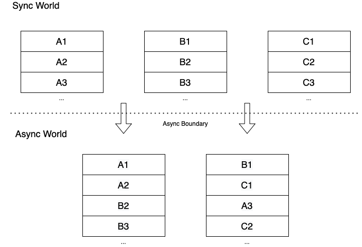

# Concurrency In Scala with Cats-Effect

This text serves as an introduction to the topic of concurrent asynchronous effects in Scala, based on the [Cats-Effect](https://typelevel.org/cats-effect/) library. 

However, many of the concepts presented here are applicable not only to other Scala effect libraries as well, but also to any system or programming language that deals with concurrency and asynchronous programming.

Note:
It should be pointed out that the intention of the text is not to provide a "better documentation". 
First, because existing material on the subject is pretty good already (you can find some links in the [References](#references) section), and secondly, because I don't consider myself anything remotely near being an expert in the field. These are simply my notes that I kept while I was exploring the topic, and that I'm willing to share with whomever might find them useful.

All code snippets are based on Cats-Effect 2, since Cats-Effect 3 wasn't yet out at the time of writing this text.

## Table of Contents

- [Introduction](#introduction)
- [Asynchronous boundary](#asynchronous-boundary)
- [Threading](#threading)
  - [Threads and thread pools](#threads-and-thread-pools)
  - [Java Executors](#java-executors)
  - [Scheduling and ExecutionContext](#scheduling-and-executioncontext)
- [Cats-Effect IO basics](#cats-effect-io-basics)
  - [Overview](#overview)
  - [Synchronous methods](#synchronous-methods)
  - [Asynchronous methods (FFI)](#asynchronous-methods-ffi)
  - [Resource handling](#resource-handling)
- [Fibers](#fibers)
  - [Definition](#definition)
  - [Continuations](#continuations)
  - [Run loop](#run-loop)
  - [Cooperative yielding](#cooperative-yielding)
  - [ContextShift](#contextshift)
  - [Examples](#examples)
  - [IO vs Future](#io-vs-future)
  - [Leaking fibers](#leaking-fibers)
  - [Summary](#summary)
- [Cats-Effect 3](#cats-effect-3)
- [Fibers outside of Scala](#fibers-outside-of-scala)
  - [Project Loom](#project-loom)
  - [Green threads](#green-threads)
- [References](#references)

## Introduction

First, some useful definitions and descriptions:
  
- Blocking:  
  Thread that executes a blocking task will wait on action until success or failure.
  
- Non-blocking:  
  Thread that executes a non-blocking task will initiate it and immediately continue with another task without waiting. When the first task is done, its result may or may not be processed by the same thread that initiated it.
  
- Synchronous:  
  Thread will complete the task, either by success or failure, before reaching any line after it. This often involves blocking, because task N+1 cannot continue until task N has finished, which might include waiting for the result from another thread.
  
- Asynchronous:  
  Task was started by one thread, but another thread (either logical or physical) will complete the task, and then return the result using a callback. Task N+1 can continue even if N hasn't finished yet.

- Concurrency:  
  State in which there are multiple logical threads of control, whose tasks are interleaved.
  
- Parallelism:  
  State in which computations are physically performed in parallel on separate CPU cores.

Note that concurrency isn't the same as parallelism: we could have concurrency without parallelism (effects are interleaved, but everything is done by one single CPU core), and we could have parallelism without concurrency (multiple cores are running multiple standalone threads that don't interleave). In this text, we are interested in the concurrent aspect of our programs, and we don't care whether some of the tasks are done in parallel or not.

Also, there seems to be a lot of confusion around blocking vs synchronous and non-blocking vs asynchronous. Some sources (especially ones related to NodeJS) often assume synchronous = blocking and asynchronous = non-blocking, while other sources point out that blocking is always synchronous, but synchronous doesn't always mean blocking (spinlock mechanisms etc.). For all intents and purposes, this text assumes that all synchronous tasks are blocking, and all asynchronous tasks are non-blocking. 

## Asynchronous boundary

Concurrency means that a single logical thread can have its tasks distributed across different threads. Or, from the thread perspective, that a single thread can execute interleaved tasks coming from different logical threads.

In order to be able to do so, we have to use asynchronous operations. Once the task has been initiated, it crosses the *asynchronous boundary*, and it resumes somewhere else.

Here are a couple of famous related quotes:

> "A Future represents a value, detached from time" - Viktor Klang ([link](https://monix.io/docs/current/eval/task.html#comparison-with-scalas-future))

> "Asynchronous process is a process that continues its execution in a different place or time than the one it started in" - Fabio Labella ([link](https://www.youtube.com/watch?v=x5_MmZVLiSM&t=6m35s))

> "A logical thread offers a synchronous interface to an asynchronous process" - Fabio Labella ([link](https://www.youtube.com/watch?v=x5_MmZVLiSM&t=11m12s))

All of the above quotes revolve around the same concept of asynchronous boundary; after our computation passes that boundary, we cannot be sure *when* it will be finished, which is why we should not block while waiting for it. We're also not sure *where* it will be finished - another OS thread, another node in our physical network, somewhere in the cloud etc. This text deals with the details of execution on OS threads (hence the relevance of the third quote), and it will not touch upon any other scenario of asynchronous execution, such as distributing the tasks over nodes in a cluster.

Speaking of third quote, bear in mind that saying "synchronous interface" comes from the fact that all our code is basically synchronous. We write commands one after another and they are executed one after another. So when you see a term "synchronous code", pay attention to the context - maybe someone meant "code that doesn't use asynchronous effects (e.g. it blocks on every asynchronous call)". In this text, however, "synchronous code" means just any code, because all code we write is in nature synchronous. It is via usage of asynchronous effects in our code that we get to cross the asynchronous boundary and model asynchronously executed operations.

Let's see how tasks are executed by OS threads (each letter-number combination represents one task):



After crossing the asynchronous boundary, the tasks get interleaved across threads in the thread pool. Some of them might even get executed on some thread from another thread pool. This is where the property of concurrency comes into play.

## Threading 

### Threads and thread pools

JVM threads map 1:1 to the operating system’s native threads. 
When CPU stops executing one thread and starts executing another thread, OS needs to store the state of the earlier task and restore the state for the current one. 
This context switch is expensive and sacrifices *throughput*. 
In ideal world we would have a fixed number of tasks and at least the same number of CPU threads; then every task would run on its own dedicated thread and throughput would be maximal, because context switches wouldn't exist. 

However, in the real world there are things to consider:
- There will be external requests from the outside that need to be served
- Even if there are no external requests and no I/O (e.g. we're just mining bitcoin), some work-stealing is bound to happen anyway, for example JVM's garbage collector

This is why it's useful to sacrifice some throughput to achieve *fairness*. High fairness makes sure that all tasks get their share of the CPU time and no task is left waiting for too long.

Asynchronous operations can be divided into three groups based on their thread pool requirements:

- Non-blocking asynchronous operations, e.g. HTTP requests, database calls
- Blocking asynchronous operations, e.g. reading from the file system
- CPU-heavy operations, e.g. mining bitcoin

These three types of operations require significantly different thread pools to run on:

- Non-blocking asynchronous operations:  
  - Bounded pool with a very low number of threads (maybe even just one), with a very high priority. These threads will basically just sit idle most of the time and keep polling whether there is a new async IO notification. Time that these threads spend processing a request directly maps into application latency, so it's very important that no other work gets done in this pool apart from receiving notifications and forwarding them to the rest of the application. 
  
- Blocking asynchronous operations:  
  - Unbounded cached pool. Unbounded because blocking operation can (and will) block a thread for some time, and we want to be able to serve other I/O requests in the meantime. Cached because we could run out of memory by creating too many threads, so it’s important to reuse existing threads.
  
- CPU-heavy operations:  
  - Fixed pool in which number of threads equals the number of CPU cores. This is pretty straightforward. Back in the day the "golden rule" was number of threads = number of CPU cores + 1, but "+1" was coming from the fact that one extra thread was always reserved for I/O (as explained above, we now have separate pools for that).

Remember: whenever you are in doubt over which thread pool best suits your needs, optimal solution is to benchmark.

### Java Executors

In Java, thread pools are modeled through `Executor` / `ExecutorService` interface. The latter provides termination capabilities and some utility functions.

Two most commonly used `Executor` implementations are: 
- [ThreadPoolExecutor](https://docs.oracle.com/javase/7/docs/api/java/util/concurrent/ThreadPoolExecutor.html) introduced in Java 5:  
  Thread pool that executes each submitted task using one of possibly several pooled threads.
  
- [ForkJoinPool](https://docs.oracle.com/javase/8/docs/api/java/util/concurrent/ForkJoinPool.html) introduced in Java 7:  
  Work-stealing thread pool that tries to make use of all your CPU cores by splitting up larger chunks of work and assigning them to multiple threads. 
If one of the threads finishes its work, it can steal tasks from other threads that are still busy. 
You can set the number of threads to be used in the pool, bounded by some configured minimum and maximum.

There are many online sources on the difference between the two - I personally like [this one](http://www.h-online.com/developer/features/The-fork-join-framework-in-Java-7-1762357.html).

Utility methods for obtaining various `Executor` implementations are available in the [Executors](https://docs.oracle.com/javase/8/docs/api/java/util/concurrent/Executors.html) class.

Here are some recommendations on which implementation to use for each of the scenarios described earlier:

- Non-blocking asynchronous operations:  
  - `Executors.newFixedThreadPool`
  
- Blocking asynchronous operations:  
  - `Executors.newCachedThreadPool`

- CPU-heavy operations:  
  - For long-running tasks: `Executors.newFixedThreadPool`  
  - For many small tasks: `new ForkJoinPool` (not available in `Executors`)  

### Scheduling and ExecutionContext

Now that the thread pools are set up, we are ready to start submitting tasks to them. 
In our program, we will simply submit a task for execution, and it will get executed at some point when it's assigned to a thread. 
This assignment is done by the *scheduler*.

There are two ways scheduling can be achieved:

- Preemptive scheduling:  
  Scheduler suspends the currently running task in order to execute another one
- Cooperative scheduling (or "cooperative yielding"):  
  Tasks suspend themselves, meaning that the currently running task at some point voluntarily suspends its own execution, so that the scheduler can give the thread to other tasks

Role of the scheduler is played by the `ExecutionContext` ([docs](https://docs.scala-lang.org/overviews/core/futures.html#execution-context)). 
Every `ExecutionContext` schedules threads only within its assigned thread pool.

In Scala, there is one global `ExecutionContext`. 
It is backed by the `ForkJoinPool` and it is available as `ExecutionContext.global`.

Whichever underlying Java executor you rely on, your level of granularity is going to be threads. 
Threads don't cooperate. 
They execute their given set of commands, and the operating system makes sure that they all get some chunk of the CPU time. That's why I can be typing this text, listening to music and compiling some code, all at the same time.

So, in order to allow tasks submitted to the `ExecutionContext` to use the principle of cooperative yielding, we have to explore the concept of **fibers**, which belong to a more general concept of [green threads](#green-threads).

We will explore fibers and cooperative yielding in [later sections](#fibers), but before we do that, we need to become familiar with some programming constructs from the Cats-Effect library.

## Cats-Effect IO basics

### Overview

Type `IO` ([docs](https://typelevel.org/cats-effect/datatypes/io.html)) is used for encoding side effects as pure values. 
In other words, it allows us to model operations from the other side of asynchronous boundary in our synchronous code. 

There are two main groups of `IO` values - those that model:
- synchronous computations
- asynchronous computations

A somewhat different definition is that `IO` consists of two things:
- FFI (Foreign Function Interface) for side-effectful asynchronous functions; see section [Asynchronous methods (FFI)](#asynchronous-methods-ffi)). Examples: `async` and `cancelable`.
- Combinators defined either directly inside `IO` or coming from type classes. Examples: `pure`, `map`, `flatMap`, `delay`, `start` etc.

### Synchronous methods

Here are several ways of producing synchronous `IO` values in a "static" way:
```
object IO {
  ...
  def pure[A](a: A): IO[A]
  def delay[A](body: => A): IO[A] // same as apply()
  def suspend[A](thunk: => IO[A]): IO[A] 
  ...
}
```

There is one more important method that we will be using heavily, but this one is not static; it's defined as a class method on values of type `IO`:

```
class IO[A] {
  ...
  def start(implicit cs: ContextShift[IO]): IO[Fiber[IO, A]]
  ...
}
```

**Pure:**

Wraps an already computed value into `IO` context, for example `IO.pure(42)`.
Comes from the [Applicative](https://typelevel.org/cats/typeclasses/applicative.html) type class (note: from [Cats](https://typelevel.org/cats/), not Cats-Effect).

**Delay:**

Used for suspension of synchronous side effects. 
Comes from the [Sync](https://typelevel.org/cats-effect/typeclasses/sync.html) type class.
Note that `IO.apply` calls `IO.delay`, which means we can call `delay` using the shorthand form `IO(value)`. 

**Suspend:**

Method `suspend` also suspends a synchronous side effect and it also comes from [Sync](https://typelevel.org/cats-effect/typeclasses/sync.html), but this time it's an effect that produces an `IO`.
Note that:
```
IO.pure(x).flatMap(f) <-> IO.suspend(f(x))
```

### Asynchronous methods (FFI)

`IO` also serves as an FFI - a [Foreign Function Interface](https://en.wikipedia.org/wiki/Foreign_function_interface). 
Most common usage of the term FFI is to serve as a translation layer between different programming languages, but here the context is a bit different: `IO` translates side-effectful asynchronous Scala operations into pure, referentially-transparent values.

Translating such operations into `IO` world is done primarily via the following two methods:

```
object IO {
  ...
  def async[A](k: (Either[Throwable, A] => Unit) => Unit): IO[A] 
  def cancelable[A](k: (Either[Throwable, A] => Unit) => CancelToken[IO]): IO[A]
  ...
}
```
  
**Async:**
 
Method `async` is used for modeling asynchronous operations in our Cats-Effect code.

It comes from the [Async](https://typelevel.org/cats-effect/typeclasses/async.html) type class.

Its signature is:

```
def async[A](k: (Either[Throwable, A] => Unit) => Unit): F[A]
```

(Note: in [Cats-Effect 3]((https://github.com/typelevel/cats-effect/issues/634)), `Async` will contain more methods)

Method `async` provides us with a way to describe an asynchronous operation (that is, operation that happens on the other side of an asynchronous boundary) in our synchronous code.

Let's say that there is some callback-based method `fetchUser` which retrieves an user from the database and possibly returns an error in case something went wrong. 
The user of this method will provide a callback which will do something with the received user or react to the received error. 
Fetching method and its callback could look something like this:

```
def fetchUser(userId: UserId): Future[User]
def callback(result: Try[User]): Unit
```

How do we now model this asynchronous operation in synchronous code?
That's what methods like `onComplete` are for (see [Future Scaladoc](https://www.scala-lang.org/api/current/scala/concurrent/Future.html)). 
We say that `onComplete` models an operation that happens on the other side of the asynchronous boundary, and it serves as an interface to our synchronous code.

Let's use `onComplete` to implement a helper function that, given a `Future`, provides us with a synchronous model of the underlying asynchronous process:

```
def asyncFetchUser(fetchResult: Future[User])(callback: Try[User] => Unit): Unit =
  fetchResult.onComplete(callback)
```

We can say that `onComplete` is a method for providing a *description* (or a model) of some asynchronous process by translating it across the asynchronous boundary to our synchronous code.

So finally, what `Async` gives us is a method from such a description to an effect type `F`, in our case `IO`.
We could therefore explain the signature of `async` with the following simplification:

```
def async[A](k: (Either[Throwable, A] => Unit) => Unit): F[A]
```
translates to
```
def async[A](k: Callback => Unit): F[A]
```
which further translates to
```
def async[A](k: AsyncProcess): F[A]
```

For example, if method `fromFuture` weren't already [implemented](https://github.com/typelevel/cats-effect/blob/dd8607baed11da140688d24e467ce76159517910/core/shared/src/main/scala/cats/effect/internals/IOFromFuture.scala#L28) for `IO`, we could implement it as:

```
def fromFuture[A](future: => Future[A]): IO[A] =
  Async[IO].async { cb =>
    future.onComplete {
      case Success(a) => cb(Right(a))
      case Failure(e) => cb(Left(e))
    }
  }
```

We don't care about what callback `cb` really does. 
That part is handled by the implementation of `async`.
Its purpose is to provide users of `async` method with a way of signaling that the asynchronous process has completed.
"Here, call this when you're done".

You can find the full code to play around with in the [code repository](https://github.com/slouc/concurrent-effects/blob/master/src/main/scala/FFI.scala).

**Cancelable:**

Method `cancelable` is present in `IO`, just like `async`, and they have similar signatures. 
Just like `async`, it creates an `IO` instance that executes an asynchronous process on evaluation. 
But unlike `async`, which comes from [Async](https://typelevel.org/cats-effect/typeclasses/async.html) type class, `cancelable` comes from [Concurrent](https://typelevel.org/cats-effect/typeclasses/concurrent.html) type class.

If you understand `async`, `cancelable` is simple. 
The difference is:
- `async` models an asynchronous computation and puts it inside an `IO` effect. 
We use the callback to signal the completion of the asynchronous computation.

- `cancelable` models a cancelable asynchronous computation and puts it inside an `IO` effect.
We use the callback to signal the completion of the asynchronous computation,
and we provide an `IO` value which contains the code that should be executed if the asynchronous computation gets canceled.
This value is of type `IO[Unit]`, declared in the signature by using the type alias `CancelToken[IO]`.

It's important to emphasize that `cancelable` does not produce an `IO` that is cancelable by the user.
You cannot say:
```
val io = IO.cancelable(...)
io.cancel // or something like that
```
Instead, what `cancelable` does is - it takes a foreign (meaning it comes from outside of our IO world)  asynchronous computation that is cancelable in its nature, and puts it in the `IO` context.
So, it allows us to model asynchronous computations in the same fashion that `async` does, but with the extra ability to define an effect that will be executed if that asynchronous computation gets canceled.

For example, such asynchronous computation could be a running thread, a database connection, a long poll to some HTTP API etc., and by using `cancelable` we can translate that foreign computation into `IO` world and define what should happen if that computation "dies" (e.g. somebody kills the database connection).

This is how we could modify our previous `async` example to include the cancelation feature:
```
def fromFutureCancelable[A](future: => Future[A]): IO[A] =
  IO.cancelable { cb =>
    future.onComplete {
      case _ => // don't use the callback!
    }
    IO(println("Rollback the transaction!"))
  }
```
Notice how we don't call the `cb` callback any more. 
By not calling `cb`, we can emulate a long running operation, one that we have enough time to cancel (remember, `cb` is used to denote the completion of the asynchronous computation that we are modelling).

If you run the [code](https://github.com/slouc/concurrent-effects/blob/master/src/main/scala/FFI.scala), you will get an infinite computation that can be stopped by manually killing the process, which then shows "Rollback the transaction!". 
If you use `async` instead of `cancelable` (also provided in the code repository), you will notice that there is no "Rollback the transaction!" line.

### Resource handling

Resource handling refers to the concept of acquiring some resource (e.g. opening a file, connecting to the database etc.) and releasing it after usage.

Cats effect model resource handling via [Resource](https://typelevel.org/cats-effect/datatypes/resource.html) type.

Here's an example (pretty much c/p-ed from the Cats website):

```
def mkResource(s: String): Resource[IO, String] = {
  val acquire = IO(println(s"Acquiring $s")) *> IO.pure(s)
  def release(s: String) = IO(println(s"Releasing $s"))
  Resource.make(acquire)(release)
}

val r = for {
  outer <- mkResource("outer")
  inner <- mkResource("inner")
} yield (outer, inner)

override def run(args: List[String]): IO[ExitCode] =
  r.use { case (a, b) => IO(println(s"Using $a and $b")) }.map(_ => ExitCode.Success)
```

For-comprehension that builds the value `r` operates on the `Resource` layer (hence, `Resource` is a monad).
We can easily compose multiple `Resource`s by flatmapping through them.

The output of the above program is:

```
Acquiring outer
Acquiring inner
Using outer and inner
Releasing inner
Releasing outer
```

As you can see, `Resource` takes care of the LIFO (Last-In-First-Out) order of acquiring / releasing.

If something goes wrong, `Resource`s are released:

```
val r = for {
  outer <- mkResource("outer")
  _ <- Resource.liftF(IO.raiseError(new Throwable("Boom!")))
  inner <- mkResource("inner")
} yield (outer, inner)
```
results with
```
Acquiring outer
Releasing outer
java.lang.Throwable: Boom!
```
and
```
val r = for {
  outer <- mkResource("outer")
  inner <- mkResource("inner")
  _ <- Resource.liftF(IO.raiseError(new Throwable("Boom!")))
} yield (outer, inner)
```
results with
```
Acquiring outer
Acquiring inner
Releasing inner
Releasing outer
java.lang.Throwable: Boom!
```

For more details on resource handling in Cats-Effect, refer to this [excellent blog post](https://medium.com/@bszwej/composable-resource-management-in-scala-ce902bda48b2).

## Fibers

### Definition

You can think of fibers as lightweight threads which use cooperative scheduling, unlike real (OS and JVM) threads which use preemptive scheduling. 

Also, fibers are managed in the user space, whereas real threads are managed in the kernel space.

Note that in some contexts / languages fibers are also known as *coroutines*; "fiber" is usually used in the system-level context, while coroutines are used in the language-level context. 
However, in Scala "fiber" is the preferred term.

Fibers map to CPU / JVM threads many-to-few, similarly to how threads map to processes. 
Multiple fibers can run on multiple thread pools, or on the same set of threads from one thread pool, or even on the same thread.
In the case of a single thread, they will take turns executing their code using the available thread. 
Depending on your code, as well as the library that you are using, you can decide to have them cooperate more often, thus achieving fairness, or to cooperate less often, thus sacrificing some fairness for more throughput (concepts of fairness and throughput have been [introduced earlier](#threads-and-thread-pools)).

As mentioned earlier, fibers are lightweight: they consume much less memory than real threads, have growable and shrinkable stacks, and can be garbage collected. 
Also, blocking a fiber doesn't block the underlying thread.
As a consequence of all that, we don't have to be as careful when creating new fibers.
On the other hand, when using threads, we're primarily constrained by the number of cores (but also other aspects).

I want to explicitly point out that fiber in Scala is a **concept**, not some native resource like process or thread. Project [Loom](https://wiki.openjdk.java.net/display/loom/Main) (also see this [blogpost](https://blog.softwaremill.com/will-project-loom-obliterate-java-futures-fb1a28508232?gi=c5487dba95ec)) aims to introduce fibers as native JVM constructs, but in Cats-Effect and other libraries fibers are a manually-implemented thing. 
This also means that there might be some minor differences in implementation across those libraries (e.g. compare [Cats-Effect](https://typelevel.org/cats-effect/datatypes/fiber.html) with [ZIO](https://zio.dev/docs/overview/overview_basic_concurrency#fibers)).

Let's see some code: in Cats-Effect, fiber is a construct with `cancel` and `join`:
```
trait Fiber[F[_], A] {
  def cancel: F[Unit]
  def join: F[A]
}
```

Joining a fiber can be thought of as blocking for completion, but only on semantic level. 
Remember, blocking a fiber doesn't really block the underlying thread, because the thread can keep running other fibers. 

A program defined as `IO` value can be executed on a fiber. 
`IO` type uses the method `start` (available as long as there is an implicit `ContextShift[IO]` in the scope) to start its execution on a fiber. `ContextShift` will be explained later; for now, think of it as Cats-Effect version of `ExecutionContext`. 
It's basically a reference to the desired thread pool that should execute the fiber. 
Note that it is most likely going to be removed in Cats-Effect 3; see [cats-effect 3](#cats-effect-3) section.

By using `start`, we can make two or more `IO`s run in parallel. 
It is also perfectly possible to describe the whole `IO` program without ever invoking `start`; this simply means that the whole `IO` program will run on a single fiber.

Here is some very simple code that demonstrates how `IO` describes side effects and runs them on a single fiber (there will be more examples in the [ContextShift](#contextshift) section):

```
import cats.effect.{ExitCode, IO, IOApp}

object MyApp extends IOApp {

  def io(i: Int): IO[Unit] = 
    IO(println(s"Hi from $i!")) // short for IO.delay or IO.apply

  val program1 = for {
    _ <- io(1)
    _ <- io(2)
  } yield ExitCode.Success

  override def run(args: List[String]): IO[ExitCode] = program1
}
```

You will notice that the main object extends `IOApp`. This is a very useful Cats-Effect trait that allows us to describe our programs as `IO` values, without having to actually run them manually by using `unsafeRunSync` or similar methods. Remember how we said earlier that invoking `start` on some `IO` requires an implicit instance of `ContextShift[IO]` in order to define the `ExecutionContext` (and hence the thread pool) to run on? Well, `IOApp` comes with a default `ContextShift` instance, which you can also override if you want to. This is why we didn't have to explicitly define any implicit `ContextShift[IO]` instance in our code. 

For-comprehension is working on `IO` layer; we could flatMap `io1` into a bunch of other `IO`s, for example reading some stuff from the console, then displaying some more stuff, then doing an HTTP request, then talking to a database, etc.

Now let's see what happens if we want to run some `IO` on a separate fiber:

```
...
val program2 = for {
  fiber <- io(1).start
  _ <- io(2)
  _ <- fiber.join
} yield ExitCode.Success
...
```

We define a chain of `IO`s, and then at some point we run some part of that chain on a separate fiber. That's the only difference from the previous program - parts where we `start` and `join` the fiber. Invoking `io1.start` produces an `IO[Fiber[IO, Unit]]`, which means we get a handle over the new fiber which we can then join later (which means waiting for completion), or cancel it on error, or keep it running until some external mechanism tells us to cancel it, etc.

It's important to realize which exact instructions in the example above get executed on which fiber. After we started the execution of `io1` on a separate fiber, everything we did afterwards was done in parallel to the original fiber. We say that the code captured in `io1` was the *source* for the new fiber.

As a small exercise, try adding a small sleep to method `io`:

```
def io(i: Int): IO[Unit] = IO({
  Thread.sleep(3000)
  println(s"Hi from $i!")
})
```

If you now measure the execution time between `program1` and `program2`, you will see that `program1` runs in six seconds, while `program2` runs in slightly over three seconds. You can find this code [in the repository](https://github.com/slouc/concurrent-effects/blob/master/src/main/scala/RunWithFiber.scala).

### Continuations

In the previous section, we have seen that fiber runs a set of instructions (the source). 
Any `IO` can be run on a fiber as long as there is a `ContextShift` type class instance available for it.
This is done by calling `.start` on it, which needs an instance of a `ContextShift` in order to know which thread pool to run the fiber on. 


Basically, this is what a fiber really is under the hood - it's a *continuation* (set of chained instructions) with a *scheduler* (in this case, `ContextShift`). 

Let's explain this further:

- Continuation is a stack of function calls that can be stopped and stored in the heap at some point (with yield) and restarted afterward (with run). We have just seen how we can build up the continuation as a series of flatmapped instructions wrapped in an `IO`. 

- Scheduler schedules fibers on a thread pool so that the execution of fiber's code can be carried by multiple worker threads. Once we do `.start` on an `IO`, we start it on a separate fiber, and scheduler schedules it on the thread pool. In Cats-Effect, role of the scheduler is performed by `ContextShift`, which uses the underlying Scala `ExecutionContext`.

### Run loop

Each fiber is associated with a *run loop* that executes the instructions from the source (that is, from the continuation) one by one. 

Run loop needs access to two JVM resources:
- execution context (forking & yielding)
- scheduled executor service (sleeping before getting submitted again)

Run loop builds up a stack of tasks to be performed. 
We could model the stack in Scala code like this:

```
sealed trait IO[+A]
case class FlatMap[B, +A](io: IO[B], k: B => IO[A]) extends IO[A]
case class Pure[+A](v: A) extends IO[A]
case class Delay[+A](eff: () => A) extends IO[A]
```

Now, let's say we have the following program:
```
val program = for {
  _ <- IO(println(s"What's up?"))
  input <- IO(readLine)
  _ <- IO(println(s"Ah, $input is up!"))
} yield ExitCode.Success
```

Run loop stack for that program would then look something like this:
```
FlatMap(
  FlatMap(
    Delay(() => print("What's up?")),
    (_: Unit) => Delay(() => readLine)
  ),
  input => Delay(() => println(s"Ah, $input is up!"))
)
```
([here](https://github.com/typelevel/cats-effect/blob/master/core/shared/src/main/scala/cats/effect/internals/IORunLoop.scala) is the link to the actual Cats-Effect `IO` run loop)

When the program is run at the "end of the world", the stack is submitted to the scheduler. 
Is it submitted all at once? Or is it submitting one layer of FlatMap at a time, each time yielding back when the task is completed, allowing other fibers to run? 

Actually, this is up to the library / construct being used:

- Scala Future: Yields back on every `FlatMap`
- IO: Yields back when the whole stack is completed
- Monix Task: Yields back every N operations (at the moment of writing this, I believe N = 1024 by default, but don't take my word for it).

This means that Scala `Future` optimizes for fairness, `IO` for throughput, and `Monix` takes the middle approach. 
Note that it's not impossible to turn things the other way around: we could prevent `Future` from yielding all the time (and thus optimize for throughput) by using a non-shifting instance of `ExecutionContext`, and we could manually force `IO` to shift after every operation (thus optimizing for fairness).

You can think of `Future` as "fairness opt-out" and `IO` as "fairness opt-in".

Note on cancellation inside the run-loop: when a cancellation command has been issued for some running `IO`, it can only be cancelled at two particular points, and one such point is inserted by the library on every 512 flatMaps in the run loop stack. 
The other one is at the asynchronous boundary (see [Context shift](#context-shift) section).

### Cooperative yielding

The relationship between fibers and threads is the following:
- It is possible to have each fiber running on its dedicated thread
- It is possible to have all fibers running on only one thread
- It is possible to have one fiber switching between multiple threads
- Usually, you will want to have M to N mapping (M = fibers, N = threads), with M > N
- Whenever multiple fibers need to compete for the same thread, they will cooperatively yield to each other, thus allowing each fiber to run a bit of its work and then allow some other fiber to take the thread
- How often and at which point fiber yields depends on the underlying implementation; in Cats-Effect, it won't yield until you tell it to, which allows fine-tuning between fairness and throughput

Because the number of fibers is usually higher than the number of threads in a given thread pool, fibers need to yield control to each other in order to make sure that all fibers get their piece of the CPU time. 
For example, in a pool with two threads that's running three fibers, one fiber will be waiting at any given point. 

In Cats-Effect 2, cooperative yielding is controlled via `ContextShift`.

### ContextShift

Note that `ContextShift` is most likely going to be removed in Cats-Effect 3; see [Cats-Effect 3](#cats-effect-3) section.
However, core principles explained here are useful to understand, because they will still be relevant in the next version.

In Cats-Effect, submitting the fiber to a thread pool is done via `ContextShift` construct. 
It has two main abilities: to run the continuation on some `ExecutionContext`, and to shift it to a different `ExecutionContext`.

Here's the trait:

```
trait ContextShift[F[_]] {
  def shift: F[Unit]
  def evalOn[A](ec: ExecutionContext)(f: F[A]): F[A]
}
```

You can think of it as a type class, even though it is not really a valid type class because it doesn't have the coherence restriction - a type can implement a type class in more than one way. For example, you might want to have a bunch of instances of `ContextShift[IO]` lying around, each constructed using a different `ExecutionContext` and representing a different thread pool (one for blocking I/O, one for CPU-heavy stuff, etc.). Constructing an instance of `ContextShift[IO]` is easy: `val cs = IO.contextShift(executionContext)`.

Method `shift` is how we achieve fairness. 
Every fiber will be executed synchronously until shifted, at which point other fibers will have the chance to advance their work. 

Don't confuse `shift` from `ContextShift` with `IO.shift`. 
The semantics are the same, but they come in slightly different forms. 
`IO` version has the following two overloads of `shift` method:

```
def shift(implicit cs: ContextShift[IO]): IO[Unit]
def shift(ec: ExecutionContext): IO[Unit]
```

These two methods are similar in nature - they both shift to the desired thread pool, one by providing the Scala's `ExecutionContext`, the other one by providing a `ContextShift`. 
It is recommended to use `ContextShift` by default, and to provide `ExecutionContext` only when you need fine-grained control over the thread pool in use. 
Note that you can simply provide the same `ContextShift` / `ExecutionContext` that you're already running on, which will have the effect of cooperatively yielding to other fibers on the same thread pool, same as `shift` from the type class 
(you can even invoke it simply as `IO.shift`, as long as you have your `ContextShift` available implicitly). 

So, just to repeat, `ContextShift` can perform a "shift" which either moves the computation to a different thread pool or sends it to the current one for re-scheduling.
Point at which the shift happens is often referred to as *asynchronous boundary*. 
Concept of asynchronous boundary has been described in the [Asynchronous boundary](#asynchronous-boundary) section, and now it has been revisited in the Cats-Effect context.

Asynchronous boundary is one of two places at which an `IO` can be cancelled (the other one is every 512 flatMaps in the run loop; see the [Run loop](#run-loop) section).

### Examples

Method `shift` will be demonstrated on two examples.

#### Example 1: Single pool

First, we will use a thread pool with only one thread, and we will start two fibers on that thread. 
Note that I'm removing some boilerplate to save space (`IOApp` etc.), but you can find the full code in the repository.
Also note that `Executors.newSingleThreadExecutor` and `Executors.newFixedThreadPool(1)` are two alternative ways of declaring the same thing. I will use the latter, simply to keep the consistency with examples that use multi-threaded pools.

```
val ec = ExecutionContext.fromExecutor(Executors.newFixedThreadPool(1))
val cs: ContextShift[IO] = IO.contextShift(ec)

def loop(id: String)(i: Int): IO[Unit] =
  for {
    _ <- IO(printThread(id))
    _ <- IO(Thread.sleep(200))
    result <- loop(id)(i + 1)
  } yield result

val program = for {
  _ <- loop("A")(0).start(cs)
  _ <- loop("B")(0).start(cs)
} yield ExitCode.Success
```
Method `printThread` is a printline statement that includes the thread identifier for extra clarity:
```
def printThread(id: String) = {
  val thread = Thread.currentThread.getName
  println(s"[$thread] $id")
}
```

Code is pretty straightforward - we have a recursive loop that goes on forever, and all it does is print out some ID ("A" or "B"). 

What gets printed out when we run the above program is an endless stream of "A", because first fiber never shifts (that is, never cooperatively yields) so the second fiber never gets a chance to run.

Now let's add the shifting part to the above code snippet:
```
def loop(id: String)(i: Int): IO[Unit] = for {
  _ <- IO(printThread(id))
  _ <- IO.shift(cs) // <--- now we shift!
  result <- loop(id)(i + 1)
} yield result
```

What gets printed out in this case is an alternating sequence of "A"s and "B"s:
```
...
[pool-1-thread-1] A
[pool-1-thread-1] B
[pool-1-thread-1] A
[pool-1-thread-1] B
[pool-1-thread-1] A
...
```

Even though we have only one thread, there are two fibers running on it, and by telling them to `shift` after every iteration, they can work cooperatively together. 
At any given point only one fiber is running on the thread, but soon it backs away and gives the other fiber an opportunity to run on the same thread.

Before we move on, let's see what happens if we run this example without spawning any separate fibers, but we keep the `shift` inside the loop. So basically we just remove the `start` parts:
```
val program = for {
  _ <- loop("A")(0) // .start(cs)
  _ <- loop("B")(0) // .start(cs)
} yield ExitCode.Success
```
What we get is:
```
[ioapp-compute-0] A
[pool-1-thread-1] A
[pool-1-thread-1] A
[pool-1-thread-1] A
...
```
The program started looping on "A" on the default main thread, and "B" never got its chance to run. 
After the first loop cycle, "A" was then shifted to the thread pool defined by `cs`. 
Each subsequent shift had the effect of yielding within the same thread, but it had no visible effect in this case, because there are no other fibers competing for the thread. 
But don't forget - we still did introduce an asynchronous boundaries with every `shift` though. 
So even if there's only one fiber running on the thread pool, that doesn't mean that `shifting` on that thread pool has no consequences (for example, every time we `shift` we set a checkpoint at which cancellation can happen if requested, as explained in the [ContextShift](#contextshift) section).

#### Example 2: Two pools

In the second example, we will have the same two fibers, but this time each fiber will get its own thread pool with a single thread.

```
val ec1 = ExecutionContext.fromExecutor(Executors.newFixedThreadPool(1))
val ec2 = ExecutionContext.fromExecutor(Executors.newFixedThreadPool(1))

val cs1: ContextShift[IO] = IO.contextShift(ec1)
val cs2: ContextShift[IO] = IO.contextShift(ec2)

def loop(id: String)(i: Int): IO[Unit] = for {
  _ <- IO(print(id))
  _ <- if (i == 10) IO.shift(cs1) else IO.unit
  result <- loop(id)(i + 1)
} yield result

val program = for {
  _ <- loop("A")(0).start(cs1)
  _ <- loop("B")(0).start(cs2)
} yield ExitCode.Success
```

We get:
```
[pool-1-thread-1] A
[pool-2-thread-1] B
[pool-1-thread-1] A
[pool-2-thread-1] B
[pool-1-thread-1] A
[pool-2-thread-1] B
...
```

This time each fiber has the opportunity to run, because each is running on its own thread (it's the operating system's job to make sure the CPU runs a little bit of each thread all the time). 
We would have observed the same behaviour if we had used a single pool with two threads, e.g. `Executors.newFixedThreadPool(2)` (try it out!). 

Now, pay attention to the shift that happens on the 10th iteration:

```
...
  _ <- if (i == 10) IO.shift(cs1) else IO.unit
...
```

At the 10th iteration of the loop, each `IO` will shift to thread pool number one. At that point, both fibers are going to get scheduled on the same thread (the only one in that pool), and there will be no subsequent `shifts`. 
So soon after initial "ABAB..." we will suddenly stop seeing "B"s:
```
...
[pool-2-thread-1] B
[pool-1-thread-1] A
[pool-2-thread-1] B
[pool-1-thread-1] A
[pool-1-thread-1] A
[pool-1-thread-1] A
...
```
 
If we would keep shifting now (e.g. by saying `i > 10` instead of `i == 10`), we would keep getting "A"s and "B"s interchangeably like we have so far. 
But we only shifted once, both loops to the same `ContextShift` (that is, to the same single threaded thread pool), and we stopped shifting at that point. 
So both fibers ended up stuck on a single thread, and without further shifts, one of them will starve.

### IO vs Future

What do you think happens if we swap `IO` for a `Future` in the cases we saw earlier?

Let's start with the single threaded example:

``````
implicit val ec = ExecutionContext.fromExecutor(Executors.newFixedThreadPool(1))

def printThread(id: String) = Future {
  val thread = Thread.currentThread.getName
  println(s"${LocalDateTime.now} [$thread] $id")
}

def loop(id: String)(i: Int): Future[Unit] =
for {
  _ <- printThread(id)
  _ <- Future(Thread.sleep(200))
  result <- loop(id)(i + 1)
} yield result

val program = for {
  _ <- loop("A")(0)
  _ <- loop("B")(0)
} yield ExitCode.Success

Await.result(program, Duration.Inf)
``````
As expected, this prints out `[pool-1-thread-1] A` indefinitely.

But what happens if we now change to `Executors.newFixedThreadPool(2)`?
In the case of fibers, "A" and "B" would be executed concurrently, and we would see them taking turns in being printed out. 

But with `Future`s, we get 
```
[pool-1-thread-1] A
[pool-1-thread-2] A
[pool-1-thread-1] A
[pool-1-thread-2] A
[pool-1-thread-2] A
[pool-1-thread-1] A
```
Note how threads are still taking turns, but they are both are executing "A".

Why does this happen?

On every `flatMap` call (`map` too), `Future` needs to have access to the `ExecutionContext`:
```
def flatMap[S](f: T => Future[S])(implicit executor: ExecutionContext): Future[S]
```
In every step of the for-comprehension, `Future` will dispatch its computation back to our two-threaded pool (note: I heard that implementation of `Future` might change in this regard and that calls to `ExecutionContext` are going to be "batched" to improve performance, but I couldn't find any official source for this at the time of writing). 

This explains why we see alternating threads taking turns in computing "A".

But why is there no "B"? Because there are no fibers. Remember, with `IO` we ran two separate fibers on the same `ContextShift` (that is, on the same thread pool) by using `.start`, and we shifted from one to another whenever we invoked `shift`.
And because `IO` is lazy, `loop` didn't run endlessly over and over again inside the first step of the for-comprehension before even getting to the second one. 
Instead, we lazily defined two (endless) `IO` computations and we declared that we wanted to run them on separate fibers, either on the same thread pool or on separate ones (we had both situations throughout the examples).
Then, once we executed the full program, we observed the behaviour of two fibers running on the thread pool(s), either in a cooperative way or in a selfish way, depending on whether we `shifted` or not.

But with `Future`s, there is no concept of a fiber. 
This means that, instead of defining two separate fibers in our two-step for-comprehension, we simply defined a chain of two computations, both being infinitely recursive.
So what happens is that loop "A" runs indefinitely, forever calling itself recursively, and our code never even gets the chance to run the loop "B". 
But on each recursive call of the "A" loop, underlying `ExecutionContext` delegates the computation to one of the two available threads, which is why we saw the threads alternating.

Note that we would have observed the same behaviour using `IO` if we hadn't started the loops on separate fibers using `.start`.

### Leaking fibers

In real world scenarios, you want to join started fibers when you're done with them (unless you cancel them).
But there's a lurking danger if you're using multiple fibers:

```
val f1 = for {
  f1 <- IO(Thread.sleep(1000)).start
   _ <- f1.join
   _ <- IO(println("Joined f1"))
} yield ()

val f2 = for {
  f2 <- IO.raiseError[Unit](new Throwable("boom!")).start
  _ <- f2.join
  _ <- IO(println("Joined f2"))
} yield ()

val program = (f1, f2).parMapN {
  case _ => ExitCode.Success
}
```

In the above example, not only will we never see "Joined f2", but we will also never see "Joined f1". 
Fiber `f2` will explode and fiber `f1` will leak.

Fibers should therefore always be used within a safe allocation mechanism, otherwise they might leak resources when cancelled.
In the [Resource handling](#resource-handling) section, one such mechanism has been shown, using the `Resource` construct. 

Here is an example of using that mechanism to assure safety upon fiber cancelation:

```
def safeStart[A](id: String)(io: IO[A]): Resource[IO, Fiber[IO, A]] =
  Resource.make(io.start)(fiber => fiber.cancel >> IO(println(s"Joined $id")))

val r1 = safeStart("1")(IO(Thread.sleep(1000)))
val r2 = safeStart("2")(IO.raiseError[Unit](new Throwable("boom!")))

val program = (r1.use(_.join), r2.use(_.join)).parMapN {
  case _ => ExitCode.Success
}
```

This time you will notice that both "Joined 1" and "Joined 2" got printed out, which means that both fibers got joined and didn't leak.

### Summary

Type class `ContextShift` gives us the ability to execute an effect on some desired thread pool via `evalOn` by providing the `ExecutionContext`, or to `shift`, which re-schedules the fiber in the current thread pool and enables cooperative yielding. 

We get the same two abilities in `IO`, but in that case `shift` takes the thread pool as a parameter, either as `ExecutionContext` or (implicit) `ContextShift`. 
This means that we can cooperatively yield to another fiber within the same thread pool by passing the reference to the current one, and we can also shift to a different one. In other words, `IO.shift` provides both the type class `shift` functionality, and the type class `evalOn` functionality.

In case of `Future`, there are no fibers. We pass an `ExecutionContext` to each map / flatMap call, which means that every `Future` computation might be executed on a different thread (this is up to the passed `ExecutionContext` and how it decides to schedule the work).
What we cannot do with `Future`s, however, is define two concurrent computations that will reuse the same thread cooperatively.

## Cats-Effect 3

At the time of writing this text, Cats-Effect 3 was still in the [proposal](https://github.com/typelevel/cats-effect/issues/634) phase.

Here are some important changes that are happening (there are many more, but I'm focusing on those that directly affect the things explained in this text):

1.  `ContextShift` is being removed.

    Even though Cats-Effect 3 still isn't out, the decision to remove `ContextShift` has already been made.
But that doesn't mean that the principles explained in the previous couple of sections are becoming deprecated and irrelevant.

    First of all, `evalOn` will still exist; we need the ability to run a fiber on a given thread pool. 
It will simply take `ExecutionContext` as a parameter instead of `ContextShift`.
However, it's now being constrained in a way that it will move all of the actions to the given thread pool, reverting back to the enclosing thread pool when finished (as opposed to Cats-Effect 2 which reverts back to the default pool). 
This is explained further in point 3.

2.  Method `shift` is being removed.

    In Cats-Effect 2, method `shift` has two main roles:
    - shifting to a desired thread pool, which will be done by `Async#evalOn` described in the previous point
    - cooperative yielding, which will be done by `yield` / `yielding` / `cede` / `pass` / whatever name is eventually agreed upon, and which will be part of the `Concurrent` type class (this method will actually be a bit more general, but that's more of an implementation detail).

    Note that this means removing `shift` from three different places:
    - `ContextShift.shift` is being removed completely (see point 1)
    - `Async.shift(executionContext)` is being replaced by `Async[F[_]].evalOn(f, executionContext)` (note that the former is the companion object, while the latter is the type class; I omitted the "implicitly", you get the point)
    - `IO.shift(executionContext)` and `IO.shift(contextShift)` are being replaced by `Async[IO].evalOn(executionContext)` (although there might be an `IO.evalOn(executionContext)` for convenience)

3. `Async` type class will now hold a reference to the running `ExecutionContext`.
This will enable fallback to the parent `ExecutionContext` once a fiber has terminated. 
Consider the following Cats-Effect 2 code:
    ```
    val ec1 = ExecutionContext.fromExecutor(Executors.newFixedThreadPool(1))
    val ec2 = ExecutionContext.fromExecutor(Executors.newFixedThreadPool(1))
    val ec3 = ExecutionContext.fromExecutor(Executors.newFixedThreadPool(1))
    
    val cs: ContextShift[IO] = IO.contextShift(ec1)
    
    def io(s: String) = IO(println(s"$s: ${Thread.currentThread.getName}"))
    
    val r = cs
    .evalOn(ec2)(io("A").flatMap(_ =>
      cs.evalOn(ec3)(io("B1")).flatMap(_ => io("B2"))
    ))
    ```

    There are three distinct `IO`s, which we can refer to as "A", "B1" and "B2".
Our intention is to run "A" on `ec2` and then chain it into a mini-chain "B1" -> "B2".
Thread pools are defined as follows:
    - `ContextShift` is running on `ec1`
    - "A" is running on `ec2`
    - "B1" → "B2" is a flatmapped chain that follows after "A", and first part of that chain runs on `ec3`

    The million dollar question is - which thread pool does "B2" run on?
Answer: on `ec1`. This is very unintuitive. It would feel more natural if, after finishing "B1" on `ec2`, the follow-up "B2" would run on whatever "A" was running on. Instead, we fall back all the way to the default `ExecutionContext` that our `ContextShift` was initialised with.

    In Cats-Effect 3, this will be fixed.

## Fibers outside of Scala

### Project Loom

Working with concurrent effects that has been described so far relies on the concept of fibers implemented by Scala libraries such as Cats-Effect, ZIO and Monix. 
There is an initiative, however, to move the fibers from custom library Scala code to the virtual machine itself. 

[Project Loom](https://cr.openjdk.java.net/~rpressler/loom/Loom-Proposal.html) is a proposal for adding fibers to the JVM. This way, fibers would become native-level constructs which would exist on the call stack instead of as objects on the heap.

In Project Loom, fibers are called **virtual threads**. If you take a look at the basic [description of a virtual thread](https://www.baeldung.com/java-virtual-thread-vs-thread#virtual-thread-composition), you will see that:

> "It is a continuation and a scheduler that, together, make up a virtual thread. "

You might recall that we said the same thing in the [continuations](#continuations) section:

> This is what a fiber really is under the hood - it's a *continuation* with a *scheduler*. 

Even though Loom's virtual threads are based on the same principles as the fiber mechanisms we explored in this article, there are still some implementation-specific details you would need to become familiar with. 
At the time of writing this text, [latest update](http://cr.openjdk.java.net/~rpressler/loom/loom/sol1_part1.html) on Project Loom had some interesting information about that.


### Green threads 

Fibers are an implementation of [green threads](https://en.wikipedia.org/wiki/Green_threads). 
Green threads are present in many languages. 
In some of them they are very similar to fibers, in some a bit different, but they all fit under the umbrella of "lightweight threads that are scheduled by a runtime library or a virtual machine, managed in the user space instead of in the kernel space, usually using cooperative instead of preemptive scheduling".

Here are some examples:

- Kotlin [Coroutines](https://kotlinlang.org/docs/reference/coroutines-overview.html) ([this](https://github.com/Kotlin/kotlinx.coroutines/blob/master/coroutines-guide.md) is a good doc)
- Go [Goroutines](https://tour.golang.org/concurrency/1)
- Haskell [green threads](https://books.google.de/books?id=rIVcDgAAQBAJ&pg=PA235&lpg=PA235&dq=ghc+green+threads&source=bl&ots=coVrvChTgf&sig=ACfU3U1vbMQzpNTxCb__KpdW_jmLGbB7AQ&hl=en&sa=X&ved=2ahUKEwjS_9_E7-joAhVbUhUIHSULDF0Q6AEwEHoECA0QLw#v=onepage&q=ghc%20green%20threads&f=false) (don't have a better link)
- Erlang [processes](https://www.tutorialspoint.com/erlang/erlang_processes.htm) 
- Julia [Tasks](https://docs.julialang.org/en/v1/base/parallel/)
- Common Lisp via [green-threads](https://github.com/thezerobit/green-threads) library
- And many others

## References

- Cats-effect documentation: https://typelevel.org/cats-effect/  
- Cats-effect repo: https://github.com/typelevel/cats-effect
- Cats-effect 3 proposal: https://github.com/typelevel/cats-effect/issues/634
- Monix Task documentation: https://monix.io/docs/current/eval/task.html  
- Fabio Labella - How do Fibers work: https://www.youtube.com/watch?v=x5_MmZVLiSM  
- Pawel Jurczenko - Modern JVM Multithreading: https://pjurczenko.github.io/modern-jvm-multithreading.html 
- Bartłomiej Szwej - Composable resource management in Scala: https://medium.com/@bszwej/composable-resource-management-in-scala-ce902bda48b2
- Daniel Spiewak's gist: https://gist.github.com/djspiewak/46b543800958cf61af6efa8e072bfd5c  
- Java Executors: https://docs.oracle.com/javase/8/docs/api/java/util/concurrent/Executors.html
- Fork Join Pool vs Thread Pool Executor: http://www.h-online.com/developer/features/The-fork-join-framework-in-Java-7-1762357.html
- Adam Warski about Loom: https://blog.softwaremill.com/will-project-loom-obliterate-java-futures-fb1a28508232?gi=c5487dba95ec
- Loom update: http://cr.openjdk.java.net/~rpressler/loom/loom/sol1_part1.html
- Loom-fiber repo: https://github.com/forax/loom-fiber
